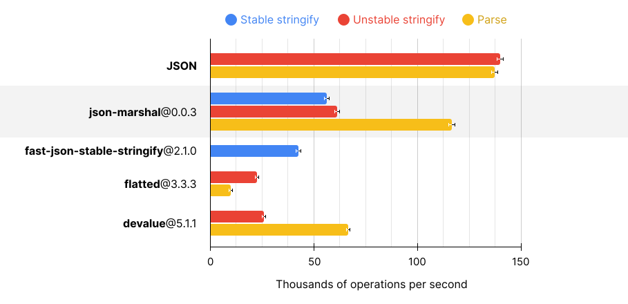

<p align="center">
  <a href="#readme"></a>
</p>

<br>

```sh
npm install --save-prod json-marshal
```

- Supports circular references.
- Supports stable serialization.
- Zero serialization redundancy — never serializes the same object twice.
- Zero dependencies.
- [Can serialize any data type via adapters.](#serialization-adapters)
- [Supports many data types out of the box.](#built-in-adapters)
- [Extremely fast.](#performance)
- [Only 2 kB gzipped.](https://pkg-size.dev/json-marshal)

```ts
import JSONMarshal from 'json-marshal';

const json = JSONMarshal.stringify({ hello: /Old/g });
// ⮕ '{"hello":[102,["Old","g"]]}'

JSONMarshal.parse(json)
// ⮕ { hello: /Old/g }
```

# Overview

The default export provides a serializer that can be used as a drop-in replacement for
[`JSON`](https://developer.mozilla.org/en-US/docs/Web/JavaScript/Reference/Global_Objects/JSON):

```ts
import JSONMarshal from 'json-marshal';

JSONMarshal.stringify('Hello');
// ⮕ '"Hello"'
```

Import [`parse`](https://smikhalevski.github.io/json-marshal/functions/json_marshal.parse.html) and
[`stringify`](https://smikhalevski.github.io/json-marshal/functions/json_marshal.stringify.html) functions separately to
have a fine-grained control over serialization:

```ts
import { stringify, parse, SerializationOptions } from 'json-marshal';
import regexpAdapter from 'json-marshal/adapter/regexp';

const options: SerializationOptions = {
  adapters: [regexpAdapter()]
};

const json = serialize({ hello: /Old/g }, options);
// ⮕ '{"hello":[102,["Old","g"]]}'

parse(json, options);
// ⮕ { hello: /Old/g }
```

Or create a custom serializer:

```ts
import { createSerializer } from 'json-marshal';
import arrayBufferAdapter from 'json-marshal/adapter/array-buffer';

const serializer = createSerializer({ adapters: [arrayBufferAdapter()] });

const json = serializer.stringify(new TextEncoder().encode('aaa bbb ccc'));
// ⮕ '[105,["YWFhIGJiYiBjY2M=",2]]'

serializer.parse(json);
// ⮕ Uint8Array
```

JSON Marshal supports circular references:

```ts
const obj = {};

obj.circularReference = obj;

serialize(obj);
// ⮕ '{"circularReference":[0,0]}'
```

Out of the box `undefined`, `NaN`, `Infinity`, and `BigInt` are stringified:

```ts
stringify(undefined);
// ⮕ '[1]'

stringify(1_000_000n);
// ⮕ '[5,"1000000"]'
```

By default, object properties with `undefined` values aren't serialized. Force `undefined` properties serialization with
[`isUndefinedPropertyValuesPreserved`](https://smikhalevski.github.io/json-marshal/interfaces/json_marshal.SerializationOptions.html#isUndefinedPropertyValuesPreserved)
option:

```ts
const obj = { hello: undefined };

stringify(obj);
// ⮕ '{}'

stringify(obj, { isUndefinedPropertyValuesPreserved: true });
// ⮕ '{"hello":[1]}'
```

All objects are always serialized only once and then referenced if needed, so no excessive serialization is performed.
This results in a smaller output and faster serialization/deserialization times in [comparison to peers](#performance):

```ts
import JSONMarshal from 'json-marshal';

const user = { name: 'Bill' };

const employees = [user, user, user];

JSON.stringify(employees);
// ⮕ '[{"name":"Bill"},{"name":"Bill"},{"name":"Bill"}]'

JSONMarshal.stringify(employees);
// ⮕ [{"name":"Bill"},[0,1],[0,1]]
```

By default, object property keys appear in the serialized string in the same order they were added to the object:

```ts
import { stringify } from 'json-marshal';

stringify({ kill: 'Bill', hello: 'Greg' });
// ⮕ '{"kill":"Bill","hello":"Greg"}'
```

Provide
[`isStable`](https://smikhalevski.github.io/json-marshal/interfaces/json_marshal.SerializationOptions.html#isStable)
option to sort keys in alphabetical order:

```ts
stringify({ kill: 'Bill', hello: 'Greg' }, { isStable: true });
// ⮕ '{"hello":"Greg","kill":"Bill"}'
```

# Serialization adapters

Provide a serialization adapter that supports the required object type to enhance serialization:

```ts
import { stringify } from 'json-marshal';
import arrayBufferAdapter from 'json-marshal/adapter/array-buffer';

const json = stringify(new ArrayBuffer(10), { adapters: [arrayBufferAdapter()] });
// ⮕ '[105,["AAAAAAAAAAAAAA==",0]]'
```

When deserializing, the same adapters must be provided, or an error would be thrown:

```ts
import { parse } from 'json-marshal';

parse(json);
// ❌ Error: Adapter not found for tag: 105

parse(json, { adapters: [arrayBufferAdapter()] });
// ⮕ ArrayBuffer(10)
```

## Built-in adapters

Built-in adapters can be imported from `json-marshal/adapter/*`:

```ts
import arrayBufferAdapter from 'json-marshal/adapter/array-buffer';

stringify(new ArrayBuffer(10), { adapters: [arrayBufferAdapter()] });
```

[json-marshal/adapter/array-buffer](https://smikhalevski.github.io/json-marshal/modules/adapter_array_buffer.html)
<br>Serializes [typed arrays](https://developer.mozilla.org/en-US/docs/Web/JavaScript/Reference/Global_Objects/TypedArray#typedarray_objects),
[`DataView`](https://developer.mozilla.org/en-US/docs/Web/JavaScript/Reference/Global_Objects/DataView)
and [`ArrayBuffer`](https://developer.mozilla.org/en-US/docs/Web/JavaScript/Reference/Global_Objects/ArrayBuffer)
instances as Base64-encoded string.

[json-marshal/adapter/date](https://smikhalevski.github.io/json-marshal/modules/adapter_date.html)
<br>Serializes `Date` instances.

[json-marshal/adapter/error](https://smikhalevski.github.io/json-marshal/modules/adapter_error.html)
<br>Serializes [`DOMException`](https://developer.mozilla.org/en-US/docs/Web/API/DOMException),
[`Error`](https://developer.mozilla.org/en-US/docs/Web/JavaScript/Reference/Global_Objects/Error),
[`EvalError`](https://developer.mozilla.org/en-US/docs/Web/JavaScript/Reference/Global_Objects/EvalError),
[`RangeError`](https://developer.mozilla.org/en-US/docs/Web/JavaScript/Reference/Global_Objects/RangeError),
[`ReferenceError`](https://developer.mozilla.org/en-US/docs/Web/JavaScript/Reference/Global_Objects/ReferenceError),
[`SyntaxError`](https://developer.mozilla.org/en-US/docs/Web/JavaScript/Reference/Global_Objects/SyntaxError),
[`TypeError`](https://developer.mozilla.org/en-US/docs/Web/JavaScript/Reference/Global_Objects/TypeError), and
[`URIError`](https://developer.mozilla.org/en-US/docs/Web/JavaScript/Reference/Global_Objects/URIError).

[json-marshal/adapter/map](https://smikhalevski.github.io/json-marshal/modules/adapter_map.html)
<br>Serializes `Map` instances. If `isStable` option is provided, `Map` keys are sorted in alphabetical order.

[json-marshal/adapter/regexp](https://smikhalevski.github.io/json-marshal/modules/adapter_regexp.html)
<br>Serializes `RegExp` instances.

[json-marshal/adapter/set](https://smikhalevski.github.io/json-marshal/modules/adapter_set.html)
<br>Serializes `Set` instances. If `isStable` option is provided, `Set` items are sorted in alphabetical order.

## Authoring a serialization adapter

Create a custom adapter for your object type. For example, let's create a `Date` adapter:

```ts
import { SerializationAdapter } from 'json-marshal';

const dateAdapter: SerializationAdapter<Date, string> = {
  tag: 1111,

  canPack(value) {
    return value instanceof Date;
  },

  pack(value, options) {
    return value.toISOString();
  },

  unpack(payload, options) {
    return new Date(payload);
  },
};
```

Here's how to use the adapter:

```ts
import { stringify, parse } from 'json-marshal';

const json = stringify(new Date(), { adapters: [dateAdapter] });
// ⮕ '[1111,"2025-03-30T13:13:59.135Z"]'

parse(json, { adapters: [dateAdapter] });
// ⮕ Date
```

Or create a custom serializer:

```ts
import { createSerializer } from 'json-marshal';

const serializer = createSerializer({ adapters: [dateAdapter] });

const json = serializer.stringify(new Date());
// ⮕ '[1111,"2025-03-30T13:13:59.135Z"]'

serializer.parse(json);
// ⮕ Date { 2025-03-30T13:13:59.135Z }
```

[`tag`](https://smikhalevski.github.io/json-marshal/interfaces/json_marshal.SerializationAdapter.html#tag) is an integer
that uniquely identifies the adapter during serialization and deserialization.

> [!IMPORTANT]\
> Tags in range [0, 199] are reserved for internal use and [built-in adapters](#built-in-adapters).

During serialization, each value is passed to the
[`canPack`](https://smikhalevski.github.io/json-marshal/interfaces/json_marshal.SerializationAdapter.html#canPack)
method which should return `true` if an adapter can pack a value as a serializable payload.

Then the [`pack`](https://smikhalevski.github.io/json-marshal/interfaces/json_marshal.SerializationAdapter.html#pack)
method converts the value into a serializable payload. The payload returned from the
`pack` method is dehydrated before stringification: circular and repeated references are encoded.

During deserialization,
[`unpack`](https://smikhalevski.github.io/json-marshal/interfaces/json_marshal.SerializationAdapter.html#unpack) method
receives the dehydrated payload and must return the shallow value to which references may point. Note that since payload
isn't hydrated at this  stage, it may still contain encoded refs.

After payload is unpacked,
[`hydrate`](https://smikhalevski.github.io/json-marshal/interfaces/json_marshal.SerializationAdapter.html#hydrate)
method is called and it receives the value returned by `unpack` and hydrated payload.

Separation of `unpack` and `hydrate` allows to restore cyclic references in an arbitrary object.

Let's create a `Set` adapter to demonstrate how to use `hydrate`:

```ts
import { SerializationAdapter } from 'json-marshal';

const setAdapter: SerializationAdapter<Set<any>, any[]> = {
  tag: 2222,

  canPack(value) {
    return value instanceof Set;
  },

  pack(value, options) {
    return Array.from(value);
  },

  unpack(payload, options) {
    // Return an empty Set, we'll populate it with hydrated items later
    return new Set();
  },

  hydrate(value, payload, options) {
    // Add hydrated items to the Set
    for (const item of payload) {
      value.add(item);
    }
  },
};
```

Now we can stringify and parse `Set` instances using `setAdapter`:

```ts
import { stringify, parse } from 'json-marshal';

const json = stringify(new Set(['aaa', 'bbb']), { adapters: [setAdapter] });
// ⮕ '[2222,["aaa","bbb"]]'

parse(json, { adapters: [setAdapter] });
// ⮕ Set { 'aaa', 'bbb' }
```

Let's stringify a `Set` that contains a self-reference:

```ts
import { stringify, parse } from 'json-marshal';

const obj = new Set();

obj.add(obj);

const json = stringify(obj, { adapters: [setAdapter] });
// ⮕ '[2222,[[0,0]]]'

parse(json, { adapters: [setAdapter] });
// ⮕ Set { <self_reference> }
```

# Performance

The chart below showcases the performance comparison of JSON Marshal and its peers, in terms of thousands of operations
per second (greater is better).

<p align="center"><picture>
  <source media="(prefers-color-scheme: dark)" srcset="./assets/perf-dark.svg" />
  <source media="(prefers-color-scheme: light)" srcset="./assets/perf-light.svg" />
  
</picture></p>

Tests were conducted using [TooFast](https://github.com/smikhalevski/toofast#readme) on Apple M1 with Node.js v23.1.0.

To reproduce [the performance test suite](./src/test/index.perf.js) results, clone this repo and run:

```shell
npm ci
npm run build
npm run perf
```
